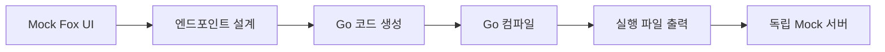

# Mock Fox

[](LICENSE)
[]()
[]()
[](https://www.electronjs.org/)

---

**API 명세 작성부터 실행 가능한 Mock 서버 생성까지, 단 한 번의 클릭으로.**

Mock Fox는 기획자, 디자이너, 개발자 누구나 **직관적인 인터페이스**를 통해
RESTful API 명세를 작성하고, 클릭 한 번으로 **실행 가능한 로컬 Mock 서버**를 빌드할 수 있는
**로컬 퍼스트(Local-first) 오픈소스 데스크톱 애플리케이션**입니다.

복잡한 환경 구성, 서버 비용, 별도의 런타임 설치는 필요 없습니다.
**아이디어 → 명세 → Mock 서버 실행**을 하루 안에 끝낼 수 있습니다.

---

## 주요 기능

### 핵심 기능

- **한 번의 클릭으로 실행 가능한 Mock 서버 생성** (Go 기반 컴파일)
- **API 명세 HTML 문서 자동 생성** (공유 및 문서화용)
- **독립 실행 파일(.exe/.app) 출력** – 별도 런타임 불필요
- **직관적 엔드포인트 편집기** (Method, Path, Query, Header, Body, Response JSON)
- **실시간 자동저장** – 작업 내용 손실 방지

### 고급 기능

- **템플릿 시스템** – 샘플 데이터로 빠른 시작
- **버전 관리** – 프로젝트 히스토리 추적
- **코드 모드** – JSON 형식 자동 포맷팅 및 검증
- **응답 예시 관리** – 다양한 시나리오별 응답 설정
- **cURL 명령어 자동 생성** – 테스트 및 공유용
- **키보드 단축키** – 효율적인 워크플로우

### 크로스플랫폼 지원

- **macOS** (Intel & Apple Silicon)
- **Windows** (x64)
- **100% 오프라인 동작** – 외부 서비스 의존 없음

---

## 설치 방법

### Option 1: 사전 빌드된 바이너리 다운로드 (권장)

[최신 릴리즈 다운로드](https://github.com/The-Plain-OSS/mock-fox/releases)

- **macOS**: 준비 중
- **Windows**: **위 release에서 다운로드 가능**

### Option 2: 소스코드에서 빌드

#### 요구 사항

- **Node.js** 18.x LTS 이상

```bash
# 저장소 클론
git clone https://github.com/The-Plain-OSS/mock-fox.git
cd mock-fox

# 의존성 설치
npm install

# 개발 모드 실행
npm start

# 배포용 빌드
npm run build:mac    # macOS
npm run build:win    # Windows
```

---

## 사용법

### 기본 워크플로우

1. **프로젝트 생성**

   - Mock Fox 실행 후 새 프로젝트 생성
   - 프로젝트명, 버전, 설명 설정

2. **엔드포인트 설계**

   - 새 엔드포인트 추가
   - Method (GET, POST, PUT, DELETE, PATCH) 선택
   - 경로, 쿼리 파라미터, 헤더, 요청/응답 Body 설정

3. **Mock 서버 생성**

   - **"Mock 서버 생성"** 버튼 클릭
   - 저장 위치 선택 → 실행 파일(.exe/.app) 자동 생성
   - 생성된 서버를 더블클릭으로 실행

4. **API 명세서 내보내기**
   - **"API 명세서 내보내기"** 버튼 클릭
   - HTML 형태로 문서 생성 → 팀 공유용

### 고급 기능 활용

#### 템플릿 사용

```
1. 샘플 버튼 클릭
2. 미리 정의된 템플릿 선택 (User API, Product API 등)
3. 자동으로 엔드포인트와 데이터 생성
```

#### 버전 관리

```
1. 프로젝트 → 버전 관리
2. 현재 상태를 새 버전으로 저장
3. 이전 버전으로 복원 가능
```

#### 키보드 단축키

- `Ctrl/Cmd + S`: 프로젝트 저장
- `Ctrl/Cmd + N`: 새 엔드포인트 추가
- `↑/↓`: 엔드포인트 간 이동
- `F2`: 엔드포인트 이름 변경

---

## 템플릿 생태계

Mock Fox의 **템플릿 시스템**은 커뮤니티가 함께 만들어 나가는 핵심 기능입니다.

### 현재 제공되는 템플릿

- **User Management API** - 사용자 가입, 로그인, 프로필 관리
- **E-commerce API** - 상품, 주문, 결제 시스템
- **Blog API** - 게시글, 댓글, 카테고리 관리
- **Todo API** - 할 일 관리 시스템
- **File Upload API** - 파일 업로드 및 관리

### 템플릿 기여 문화

**Mock Fox는 사용자들의 기여를 통해 템플릿 생태계를 발전시켜 나갑니다.**

#### 기여 방법

1. **새로운 산업군 템플릿 제안**

   - 게임 API (플레이어, 아이템, 랭킹)
   - IoT API (디바이스, 센서 데이터, 제어)
   - 금융 API (계좌, 거래, 결제)
   - 헬스케어 API (환자, 진료, 처방)

2. **기존 템플릿 개선**

   - 더 실제적인 데이터 구조
   - 다양한 시나리오 추가
   - 에러 케이스 포함

3. **지역화된 템플릿**
   - 한국형 결제 시스템 (카카오페이, 네이버페이)
   - 일본 쇼핑몰 API
   - 글로벌 배송 API

#### 템플릿 제출 가이드라인

- **실제 프로덕션에서 사용 가능한 구조**
- **최소 5개 이상의 엔드포인트**
- **다양한 HTTP 메서드 활용**
- **현실적인 데이터 예시**
- **에러 응답 케이스 포함**

#### 템플릿 검토 과정

1. GitHub Issues에 템플릿 제안
2. 커뮤니티 피드백 수집
3. 코드 리뷰 및 검증
4. 메인 브랜치 병합
5. 다음 릴리즈에 포함

**템플릿 기여자는 프로젝트 내 Contributors로 인정되며, 특별히 README에 기여 내역이 표시됩니다.**

---

## 아키텍처

### 기술 스택

- **Frontend**: Electron + HTML/CSS/JavaScript + Tailwind CSS
- **Backend**: Go (Mock 서버 런타임)
- **데이터**: LocalStorage (Local-first 철학)
- **빌드**: Electron Builder + Go Compiler

### 작동 원리



1. **설계 단계**: 사용자가 UI에서 API 엔드포인트 설계
2. **코드 생성**: Go HTTP 서버 코드 자동 생성
3. **컴파일**: 내장 Go 컴파일러로 실행 파일 생성
4. **배포**: 독립 실행 가능한 Mock 서버 완성

---

## 왜 Mock Fox인가?

### 핵심 가치

- **접근성**: 코딩 경험이 없어도 사용 가능한 직관적 UI
- **독립성**: 인터넷 연결, 외부 서비스 의존성 없음
- **효율성**: 기획-개발-QA 병렬 진행으로 개발 사이클 단축
- **이식성**: 생성된 Mock 서버는 어디서든 실행 가능

### 기존 도구와의 차이점

| 기능               | Mock Fox           | 기존 도구들            |
| ------------------ | ------------------ | ---------------------- |
| **실행 파일 생성** | ✅ 한 번의 클릭    | ❌ 복잡한 설정         |
| **오프라인 작업**  | ✅ 100% 로컬       | ❌ 클라우드 의존       |
| **런타임 의존성**  | ✅ 제로 의존성     | ❌ Node.js/Python 필요 |
| **팀 공유**        | ✅ 실행 파일 공유  | ❌ 환경 구성 필요      |
| **사용자 접근성**  | ✅ 비개발자 친화적 | ❌ 개발자 전용         |

Mock Fox는 단순한 **API 문서 도구**가 아니라,
**개발 사이클을 혁신적으로 단축하는 새로운 워크플로우 도구**입니다.

---

## 기여 방법

Mock Fox는 **열린 협업**을 지향합니다.
이슈 보고, 기능 제안, PR 제출 모두 환영합니다.

### 기여 과정

1. **이슈 작성**: 버그 리포트 또는 기능 요청
2. **Fork & Branch**: 저장소 Fork 후 기능 브랜치 생성
3. **개발 & 테스트**: 로컬에서 충분한 테스트
4. **Pull Request**: 명확한 설명과 함께 PR 제출
5. **코드 리뷰**: 메인테이너와 함께 코드 리뷰
6. **머지**: 리뷰 완료 후 메인 브랜치에 병합

### 개발 환경 설정

```bash
git clone https://github.com/The-Plain-OSS/mock-fox.git
cd mock-fox
npm install
npm start  # 개발 서버 실행
```

### 코드 스타일

- **JavaScript**: ES6+ 모던 문법 사용
- **CSS**: Tailwind CSS 클래스 우선 사용
- **커밋**: Conventional Commits 형식 권장

---

## 팀

**Lead Maintainer**: [Woojin Kim](mailto:xhae000@gmail.com)
**Contributors**: [전체 기여자 목록](https://github.com/The-Plain-OSS/mock-fox/graphs/contributors)

### 연락처

- **이슈 및 기능 요청**: [GitHub Issues](https://github.com/The-Plain-OSS/mock-fox/issues)
- **일반 문의**: [xhae000@gmail.com](mailto:xhae000@gmail.com)
- **커뮤니티**: [GitHub Discussions](https://github.com/The-Plain-OSS/mock-fox/discussions)

---

<div align="center">

**Mock Fox — Easy to API!**

</div>
